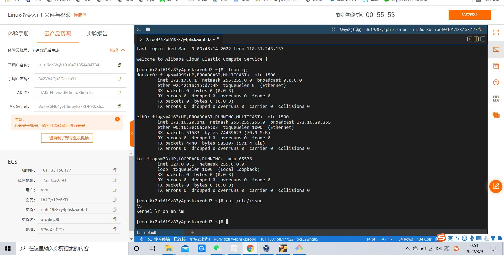
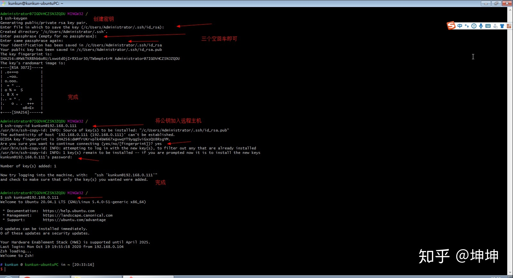

# linux第一章作业

【注】：由于第一次做作业的时候很早，所以并不是先进行了免密登录，再做其他的题的……我的做题顺序是1,3,4,2，所以会存在一些截图的使用背景不是免密登录的情况……

​                后来做了一些修改，尽力把所有情况都补上了

### 一、调查版本信息

- 调查并记录实验环境的如下信息：

  - 当前 Linux 发行版基本信息
  - 当前 Linux 内核版本信息

  #### 【介绍一下关于linux全部发行版本的简要概述--来自网络资料】


参考资料：https://blog.csdn.net/qq_37996632/article/details/83759010

基本上可以分为三大系列：Redhat，Debian，Arch

以及其他自成体系的发行版如opensuse，slackware，gentoo。

 


#### 当前实验环境所用版本：

#####  1.ubuntu上的

######  Linux 发行版本信息:

ubuntu 20.04.2 LTS

方法：命令行输入

```
lsb_release -a
```


或者

```
cat /etc/issue
```


###### Linux 内核版本信息：

方法：命令行输入

```
uname -a 
```


或者

```
cat /proc/version
```


得到当前linux内核版本信息：

linux version 5.4.0-65-generic


##### 2.cent os上的（阿里云）

###### 1.发行版

CentOS Linux release 7.7.1908 (Core)

```
cat /ect/issue
```



或者

```
lsb_release -a
```


###### 2.内核版

Linux version 3.10.0-1062.18.1.el7.x86_64

```
cat /proc/version
```


### 二、Virtualbox 安装完 Ubuntu 之后新添加的网卡如何实现系统开机自动启用和自动获取 IP？

【注：linux命令大全：https://blog.csdn.net/qq_40749830/article/details/106945879】

这个应该是18.04版本有的，20.04的新网卡是自动配置好ip的，所以就去网上查了一下18.04版本时的ip配置，并附上链接：

【ubuntu设置静态ip:https://www.cnblogs.com/yaohong/p/11593989.html】

【ubuntu18.04配置静态ip和动态ip：https://blog.csdn.net/u014454538/article/details/88646689】

参考资料：https://blog.csdn.net/xiongyangg/article/details/110206220

https://ubuntu.com/server/docs/network-configuration


##### [方法]

##### 1.检测有没有网卡。用了手动联网

```
sudo apt install net-tools
```


这是检测出目前的网卡

```
ifconfig
```


##### 2.找到对应文件

```
cd /etc/netplan
```

```
ls
```


##### 3.进入vim编辑器，更改网卡设置

```
sudo vi /etc/netplan/00-installer-config.yaml
```


##### 4.应用更改后的网卡配置

```
sudo netplan apply
```


因为是双网卡，所以新添加的三个网卡显示不出来。

不过方法是这样，最后再执行

```
ifconfig
```

就可以看到加入新网卡后的全部网卡了。


### 三、如何使用 `scp` 在「虚拟机和宿主机之间」、「本机和远程 Linux 系统之间」传输文件？

#### 【一】「虚拟机和宿主机之间」（用的是winscp）

##### 1.用winscp软件进行传输文件

【参考资料：https://www.cnblogs.com/liuhui-xzz/p/11441457.html】

###### （1）安装winscp

链接：
https://winscp.net/eng/download.php


###### （2）找到要链接的ip

此时虚拟机的主机ip应该用 

```
ip a
```

获取，并且要把虚拟机的网卡一和网卡二改成相应形式，如下所示：


打开winscp，把虚拟机的主机和用户名密码都填好。


###### （3）检测是否可以传输文件

- 首先在scp的宿主机桌面上新建一个文件


- 在scp界面中找到新建的文件，右键点击上传
- （我这里为了确保实验，所以在右侧虚拟机中也建好了实验用的文件夹，方便后来去虚拟机中找到）


- 打开虚拟机。输入指令

  ```
  cd /home/（你接下来在scp右侧看到的存了shiyan.txt 的路径）
  例如
  cd /home/cuc/shiyan
  ```

  于是打开了文件夹，接下来找到文件，输入指令

  ```
  ls
  ```

  

  打开shiyan文件夹底下的全部文件，就能找到shiyan.txt，确实已经上传成功了，所以证明这个用winscp上传文件的方法可行。

**！【注意】：新建的文件夹和文件都必须为英文名不然输入不进去，也就是说在虚拟机里打不出中文，也就查不到中文文件了。**


###### 【补充】：（用gitbash中的scp做的大概阐述）

原理和接下来要讲的本机和远程linux系统差不多，就不想演示了，大概叙述一下(主要是之前用winscp做好了，临时突然想起来还可以这么写，就想补充一下)

从本地传送到虚拟机的时候

首先在本地创建文件，如同阿里云的代码

在linux虚拟机scp的时候，因为是从本地传送到虚拟机，所以首先先用ssh,免密登录一下linux，然后用[scp] [用户名@id] [你所创建的文件的路径]，就可以传输文件了。

【注意，这里的用户名@id，是本机的id，也就是宿主机的id,需要用cmd】

如何查本机ip呢？打开cmd，输入

```
ipconfig
```


看到的ipv4后面的那一串，就是本机的id。


#### 【二】阿里云 ---「本机和远程 Linux 系统之间」

##### 1.用scp传输文件

###### （1）创建新文件test，并检查是否创建成功

```
touch test    #touch创建
```

```
ls
```

###### （2）查看路径

```
pwd
```

###### （3）给test文件里写入内容

```
cat test
```

```
echo "hello world in 2022-03-09 from aliyun" > test
```

```
ls
```


###### （4）通过gitbush传入本机


```
 scp root@101.133.158.177:/root/test ./
```

###### （5）检查是否传入test


```
ls
```

在目录下发现test文件，即为传输成功。


##### 2.传输文件夹

###### （1）创建test-dir文件夹

```
mkdir test-dir
```

```
ls    #检查是否创建成功
```

```
cd test-dir/
touch hello
touch aliyun-hello
touch 1234567890
touch abcde      #给test-dir文件夹中添加内容
```


###### （2）用自带的scp把阿里云上的test-dir传入本地桌面上

```
pwd    #检查一下路径
```

```
scp -r root@101.133.158.177:/root/test-dir ./
#用scp-r指令把阿里云上创建好的dir文件传输到本地桌面上
```


###### （3）检查是否成功

```
ls   #检查是否传输成功
```

```
$ scp desktop.ini root@101.133.158.177:/root/       #把传到本地桌面上的desktop.ini文件传输回去
```


检查到有desktop.ini文件即为成功。

```
ls -la desktop.ini
```


### 四、如何配置 SSH 免密登录？

【查了将近3个小时找到的完美资料，告诉了免密登录的方法】

证明一下：

**【参考资料：https://zhuanlan.zhihu.com/p/266837573】**




#### 【一】本地配置ssh


##### 1.打开gitbash

**【注意！：一定要从搜索框中搜索出gitbush，不能右键gitbash here，不然打开的路径不对，找不到ssh】**

没有gitbush的人自行下载，此处鸣谢安靖老师,当年按git时顺便按了gitbash

##### 2.配置ssh

按照上图所说，输入

```
ssh-keygen
```

然后一路空格，不用设置密码啥的。

这一步是为了配置ssh秘钥，为了之后能达成本地与linux虚拟机之间的免密登录(以后直接用gitbash登录就行，不用再次打开virtualbox登录linux了

原理大概是用ssh公私钥对，绕过密码直接用ssh登录了，安全性更高。

##### 3.将公钥加入远程主机

输入命令

```
ssh-copy-id cuc@192.168.56.101
```

然后输入yes

password输入cuc，就是linux的密码。

##### 4.完成

输入指令：

```
ssh cuc@192.168.56.101
```

出现正常登录后界面即为成功

配图：


#### 【二】在阿里云上配置ssh免密登录

##### 1.copy之前已经配置好的ssh到阿里云的虚拟机上去


##### 2.检查，可以直接在本地进行免密登录了。


### 五、问题与解答

###### **【问题1：如何退出vim】**

当时做这道题遇到了一个小问题。

就是使用vim编辑器写入新的网卡后不知道怎么退出去，后来查资料发现是先点esc，然后输入:x，就直接可以从vim中退出来。


###### **【问题2：找不到复制的公钥在linux里被放到了哪里？】**

###### **【解决：】**

###### （1）在linux里直接查找

```
cd .ssh
```

打开.ssh文件夹，然后用

```
ls
```

打开，发现里面有名叫authorized_keys的文件，即为成功。


###### （2）winscp中寻找

winscp中找到的路径和我预想中不太一样……

用搜索功能找了并且到了authorized_keys所在的文件下不过没有找到，个人认为应该是由于.ssh是隐藏文件夹，所以没有显示出来。


