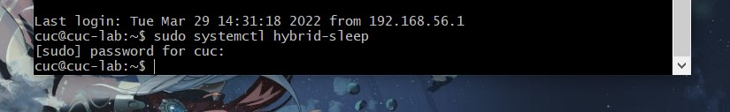
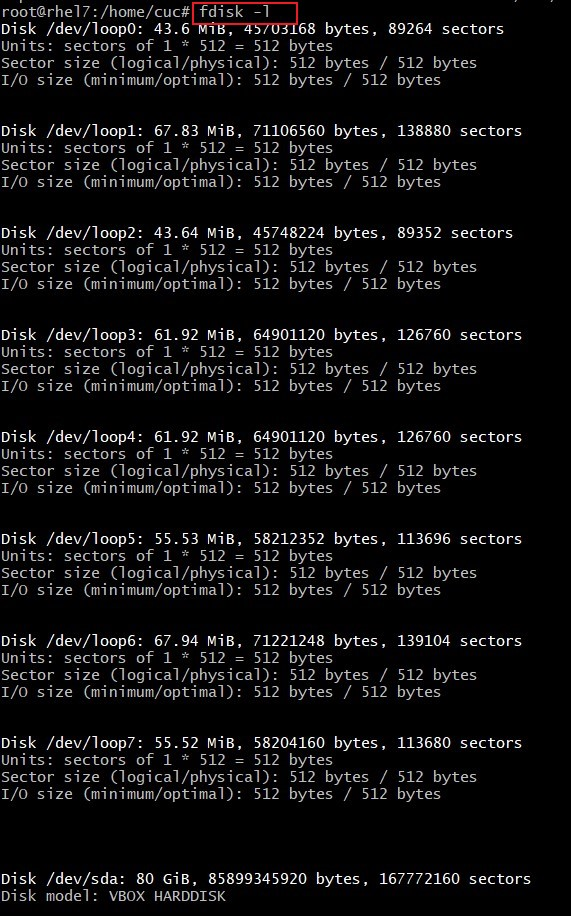
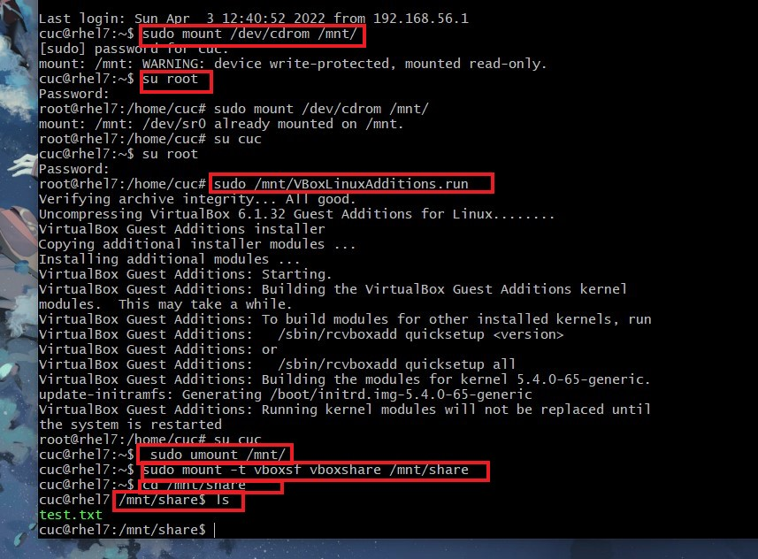
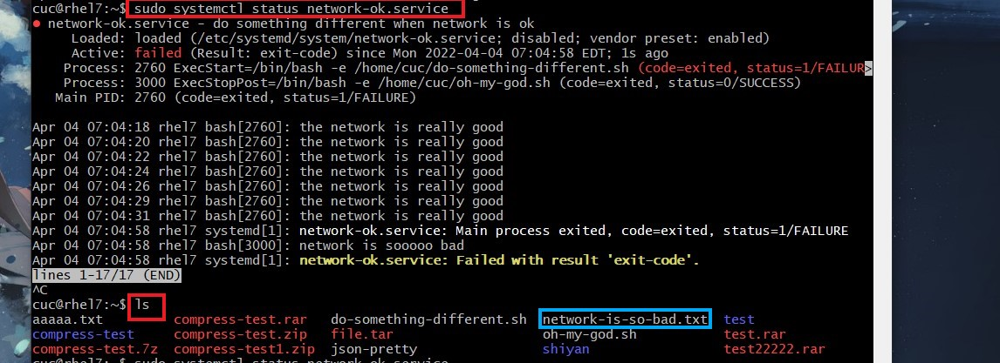

# Linux第三章实验

### 【实验目的】：

- 跟练systemd教程

  - [Systemd 入门教程：命令篇 by 阮一峰的网络日志](http://www.ruanyifeng.com/blog/2016/03/systemd-tutorial-commands.html)
  - [Systemd 入门教程：实战篇 by 阮一峰的网络日志](http://www.ruanyifeng.com/blog/2016/03/systemd-tutorial-part-two.html)

- 回答第三章linux系统管理相关问题

  

### 【实验环境】：

在gitbash上通过ssh免密登录虚拟机


### 【实验内容】：

### 一、跟练[Systemd 入门教程：命令篇 by 阮一峰的网络日志](http://www.ruanyifeng.com/blog/2016/03/systemd-tutorial-commands.html)

#### 1、Linux 的启动（apache2 ）

```linux
sudo /etc/init.d/apache2 start
```

[](https://asciinema.org/a/481705)


#### 2、查看 Systemd 的版本

```linux
systemctl --version
```

[](https://asciinema.org/a/481715)


#### 3、系统管理

##### 【3.1】`systemctl`管理系统命令组

***【因为这几个命令录不了屏（会强制关闭系统导致无法正常执行录屏命令），所以这几个命令采取截图方式来表现实验成果】***

###### (1).重启系统

```linux
# 重启系统
$ sudo systemctl reboot
```


###### (2).关闭系统，切断电源

```linux
# 关闭系统，切断电源
$ sudo systemctl poweroff
```


###### (3).CPU停止工作

```linux
# CPU停止工作
$ sudo systemctl halt
```


###### (4).暂停系统

```linux
# 暂停系统
$ sudo systemctl suspend
```


###### (5).让系统进入冬眠状态

```linux
# 让系统进入冬眠状态
$ sudo systemctl hibernate
```


###### (6).让系统进入交互式休眠状态

```linux
# 让系统进入交互式休眠状态
$ sudo systemctl hybrid-sleep
```




###### (7).启动进入救援状态（单用户状态）

```linux
# 启动进入救援状态（单用户状态）
$ sudo systemctl rescue
```


##### 【3.2】.`systemd-analyze`命令用于查看启动耗时。

```linux
# 查看启动耗时
$ systemd-analyze                                                                                       

# 查看每个服务的启动耗时
$ systemd-analyze blame

# 显示瀑布状的启动过程流
$ systemd-analyze critical-chain

# 显示指定服务的启动流
$ systemd-analyze critical-chain atd.service
```

[](https://asciinema.org/a/481761)

##### 【3.3】.`hostnamectl`命令用于查看当前主机的信息。

```linux
# 显示当前主机的信息
$ hostnamectl

# 设置主机名为rhel7。
$ sudo hostnamectl set-hostname rhel7
```

[](https://asciinema.org/a/481764)

##### 【3.4】`localectl`命令用于查看本地化设置。

```linux
# 查看本地化设置
$ localectl

# 设置本地化参数。
$ sudo localectl set-locale LANG=en_GB.utf8
$ sudo localectl set-keymap en_GB
```

[](https://asciinema.org/a/481768)

##### 【3.5】`timedatectl`命令用于查看当前时区设置。

```linux
# 查看当前时区设置
$ timedatectl

# 显示所有可用的时区
$ timedatectl list-timezones                                                                                   
# 设置当前时区
$ sudo timedatectl set-timezone America/New_York
$ sudo timedatectl set-time YYYY-MM-DD
$ sudo timedatectl set-time HH:MM:SS
```

[](https://asciinema.org/a/481774)

##### 【3.6】`loginctl`命令用于查看当前登录的用户

```linux
# 列出当前session
$ loginctl list-sessions

# 列出当前登录用户
$ loginctl list-users

# 列出显示指定用户的信息
$ loginctl show-user ruanyf
```

[](https://asciinema.org/a/481778)


#### 4、Unit

##### 【4.1】 含义

`systemctl list-units`命令可以查看当前系统的所有 Unit 。

```linux
# 列出正在运行的 Unit
$ systemctl list-units

# 列出所有Unit，包括没有找到配置文件的或者启动失败的
$ systemctl list-units --all

# 列出所有没有运行的 Unit
$ systemctl list-units --all --state=inactive

# 列出所有加载失败的 Unit
$ systemctl list-units --failed

# 列出所有正在运行的、类型为 service 的 Unit
$ systemctl list-units --type=service
```

##### 【4.2】 Unit 的状态

`systemctl status`命令用于查看系统状态和单个 Unit 的状态。

> ```linux
> # 显示系统状态
> $ systemctl status
> 
> # 显示单个 Unit 的状态
> $ systemctl status bluetooth.service
> 
> # 显示远程主机的某个 Unit 的状态
> $ systemctl -H root@rhel7.example.com status httpd.service
> ```

除了`status`命令，`systemctl`还提供了三个查询状态的简单方法，主要供脚本内部的判断语句使用。

> ```linux
> # 显示某个 Unit 是否正在运行
> $ systemctl is-active application.service
> 
> # 显示某个 Unit 是否处于启动失败状态
> $ systemctl is-failed application.service
> 
> # 显示某个 Unit 服务是否建立了启动链接
> $ systemctl is-enabled application.service
> ```

[](https://asciinema.org/a/483522)

[](https://asciinema.org/a/483524)


【补充】：因为我的电脑里没有`bluetooth.service`，所以经过一番查找后，找到了`apache2.service`这个unit，所以用它实验。

当时录视频没找到，算是一个错误，这里纠正一下。


##### 【4.3】 Unit 管理

对于用户来说，最常用的是下面这些命令，用于启动和停止 Unit（主要是 service）。

> ```linux
> # 立即启动一个服务
> $ sudo systemctl start apache2.service
> 
> # 立即停止一个服务
> $ sudo systemctl stop apache2.service
> 
> # 重启一个服务
> $ sudo systemctl restart apache2.service
> 
> # 杀死一个服务的所有子进程
> $ sudo systemctl kill apache2.service
> 
> # 重新加载一个服务的配置文件
> $ sudo systemctl reload apache2.service
> 
> # 重载所有修改过的配置文件
> $ sudo systemctl daemon-reload
> 
> # 显示某个 Unit 的所有底层参数
> $ systemctl show httpd.service
> 
> # 显示某个 Unit 的指定属性的值
> $ systemctl show -p CPUShares httpd.service
> 
> # 设置某个 Unit 的指定属性
> $ sudo systemctl set-property httpd.service CPUShares=500
> ```

[](https://asciinema.org/a/483543)

##### 【4.4】 依赖关系

Unit 之间存在依赖关系：A 依赖于 B，就意味着 Systemd 在启动 A 的时候，同时会去启动 B。

`systemctl list-dependencies`命令列出一个 Unit 的所有依赖。

> ```linux
> $ systemctl list-dependencies nginx.service
> ```

上面命令的输出结果之中，有些依赖是 Target 类型（详见下文），默认不会展开显示。如果要展开 Target，就需要使用`--all`参数。

> ```linux
> $ systemctl list-dependencies --all nginx.service
> ```

[](https://asciinema.org/a/483545)


#### 5、Unit 的配置文件

##### 【5.1】 概述

> ```linux
> $ sudo systemctl enable clamd@scan.service
> # 等同于
> $ sudo ln -s '/usr/lib/systemd/system/clamd@scan.service' '/etc/systemd/system/multi-user.target.wants/clamd@scan.service'
> ```

> ```linux
> $ sudo systemctl disable clamd@scan.service
> ```

[](https://asciinema.org/a/483555)

##### 【5.2】 配置文件的状态

`systemctl list-unit-files`命令用于列出所有配置文件。

> ```linux
> # 列出所有配置文件
> $ systemctl list-unit-files
> 
> # 列出指定类型的配置文件
> $ systemctl list-unit-files --type=service
> ```

> ```linux
> $ systemctl list-unit-files
> 
> UNIT FILE              STATE
> chronyd.service        enabled
> clamd@.service         static
> clamd@scan.service     disabled
> ```

> ```linux
> $ systemctl status bluetooth.service
> ```

> ```linux
> $ sudo systemctl daemon-reload
> $ sudo systemctl restart httpd.service
> ```

[](https://asciinema.org/a/483551)

##### 【5.3】 配置文件的格式

配置文件就是普通的文本文件，可以用文本编辑器打开。

`systemctl cat`命令可以查看配置文件的内容。

> ```linux
> $ systemctl cat atd.service
> 
> [Unit]
> Description=ATD daemon
> 
> [Service]
> Type=forking
> ExecStart=/usr/bin/atd
> 
> [Install]
> WantedBy=multi-user.target
> ```

[](https://asciinema.org/a/483558)


#### 6、Target

> ```linux
> # 查看当前系统的所有 Target
> $ systemctl list-unit-files --type=target
> 
> # 查看一个 Target 包含的所有 Unit
> $ systemctl list-dependencies multi-user.target
> 
> # 查看启动时的默认 Target
> $ systemctl get-default
> 
> # 设置启动时的默认 Target
> $ sudo systemctl set-default multi-user.target
> 
> # 切换 Target 时，默认不关闭前一个 Target 启动的进程，
> # systemctl isolate 命令改变这种行为，
> # 关闭前一个 Target 里面所有不属于后一个 Target 的进程
> $ sudo systemctl isolate multi-user.target
> ```

[](https://asciinema.org/a/483564)


#### 7、日志管理

> ```linux
> # 查看所有日志（默认情况下 ，只保存本次启动的日志）
> $ sudo journalctl
> 
> # 查看内核日志（不显示应用日志）
> $ sudo journalctl -k
> 
> # 查看系统本次启动的日志
> $ sudo journalctl -b
> $ sudo journalctl -b -0
> 
> # 查看上一次启动的日志（需更改设置）
> $ sudo journalctl -b -1
> 
> # 查看指定时间的日志
> $ sudo journalctl --since="2012-10-30 18:17:16"
> $ sudo journalctl --since "20 min ago"
> $ sudo journalctl --since yesterday
> $ sudo journalctl --since "2015-01-10" --until "2015-01-11 03:00"
> $ sudo journalctl --since 09:00 --until "1 hour ago"
> 
> # 显示尾部的最新10行日志
> $ sudo journalctl -n
> 
> # 显示尾部指定行数的日志
> $ sudo journalctl -n 20
> 
> # 实时滚动显示最新日志
> $ sudo journalctl -f
> 
> # 查看指定服务的日志
> $ sudo journalctl /usr/lib/systemd/systemd
> 
> # 查看指定进程的日志
> $ sudo journalctl _PID=1
> 
> # 查看某个路径的脚本的日志
> $ sudo journalctl /usr/bin/bash
> 
> # 查看指定用户的日志
> $ sudo journalctl _UID=33 --since today
> 
> # 查看某个 Unit 的日志
> $ sudo journalctl -u nginx.service
> $ sudo journalctl -u nginx.service --since today
> 
> # 实时滚动显示某个 Unit 的最新日志
> $ sudo journalctl -u nginx.service -f
> 
> # 合并显示多个 Unit 的日志
> $ journalctl -u nginx.service -u php-fpm.service --since today
> 
> # 查看指定优先级（及其以上级别）的日志，共有8级
> # 0: emerg
> # 1: alert
> # 2: crit
> # 3: err
> # 4: warning
> # 5: notice
> # 6: info
> # 7: debug
> $ sudo journalctl -p err -b
> 
> # 日志默认分页输出，--no-pager 改为正常的标准输出
> $ sudo journalctl --no-pager
> 
> # 以 JSON 格式（单行）输出
> $ sudo journalctl -b -u nginx.service -o json
> 
> # 以 JSON 格式（多行）输出，可读性更好
> $ sudo journalctl -b -u nginx.serviceqq
>  -o json-pretty
> 
> # 显示日志占据的硬盘空间
> $ sudo journalctl --disk-usage
> 
> # 指定日志文件占据的最大空间
> $ sudo journalctl --vacuum-size=1G
> 
> # 指定日志文件保存多久
> $ sudo journalctl --vacuum-time=1years
> ```

[](https://asciinema.org/a/483571)


### 二、跟练[Systemd 入门教程：实战篇 by 阮一峰的网络日志](http://www.ruanyifeng.com/blog/2016/03/systemd-tutorial-part-two.html)

#### 1、开机启动

```linux
$ sudo systemctl enable httpd
```

#### 2、启动服务

```linux
$ sudo systemctl start httpd
```

```linux

$ sudo systemctl status httpd

httpd.service - The Apache HTTP Server
   Loaded: loaded (/usr/lib/systemd/system/httpd.service; enabled)
   Active: active (running) since 金 2014-12-05 12:18:22 JST; 7min ago
 Main PID: 4349 (httpd)
   Status: "Total requests: 1; Current requests/sec: 0; Current traffic:   0 B/sec"
   CGroup: /system.slice/httpd.service
           ├─4349 /usr/sbin/httpd -DFOREGROUND
           ├─4350 /usr/sbin/httpd -DFOREGROUND
           ├─4351 /usr/sbin/httpd -DFOREGROUND
           ├─4352 /usr/sbin/httpd -DFOREGROUND
           ├─4353 /usr/sbin/httpd -DFOREGROUND
           └─4354 /usr/sbin/httpd -DFOREGROUND

12月 05 12:18:22 localhost.localdomain systemd[1]: Starting The Apache HTTP Server...
12月 05 12:18:22 localhost.localdomain systemd[1]: Started The Apache HTTP Server.
12月 05 12:22:40 localhost.localdomain systemd[1]: Started The Apache HTTP Server.
```

[](https://asciinema.org/a/483585)

#### 3、停止服务

终止正在运行的服务，需要执行`systemctl stop`命令。

> ```linux
> $ sudo systemctl stop httpd.service
> ```

有时候，该命令可能没有响应，服务停不下来。这时候就不得不"杀进程"了，向正在运行的进程发出`kill`信号。

> ```linux
> $ sudo systemctl kill httpd.service
> ```

此外，重启服务要执行`systemctl restart`命令。

> ```linux
> $ sudo systemctl restart httpd.service
> ```

#### 4、读懂配置文件

```
$ systemctl cat sshd.service

[Unit]
Description=OpenSSH server daemon
Documentation=man:sshd(8) man:sshd_config(5)
After=network.target sshd-keygen.service
Wants=sshd-keygen.service

[Service]
EnvironmentFile=/etc/sysconfig/sshd
ExecStart=/usr/sbin/sshd -D $OPTIONS
ExecReload=/bin/kill -HUP $MAINPID
Type=simple
KillMode=process
Restart=on-failure
RestartSec=42s

[Install]
WantedBy=multi-user.target
```

[](https://asciinema.org/a/483588)

#### 7、[Install] 区块

> ```linux
> $ systemctl get-default
> multi-user.target
> ```

上面的结果表示，默认的启动 Target 是`multi-user.target`。在这个组里的所有服务，都将开机启动。这就是为什么`systemctl enable`命令能设置开机启动的原因。

```linux
# 查看 multi-user.target 包含的所有服务
$ systemctl list-dependencies multi-user.target

# 切换到另一个 target
# shutdown.target 就是关机状态
$ sudo systemctl isolate shutdown.target
一般来说，常用的 Target 有两个：一个是
```

#### 8.Target 的配置文件

```linux
$ systemctl cat multi-user.target

[Unit]
Description=Multi-User System
Documentation=man:systemd.special(7)
Requires=basic.target
Conflicts=rescue.service rescue.target
After=basic.target rescue.service rescue.target
AllowIsolate=yes
```

#### 9.修改配置文件后重启

```linux
# 重新加载配置文件
$ sudo systemctl daemon-reload

# 重启相关服务
$ sudo systemctl restart foobar
```

[](https://asciinema.org/a/483592)


### 三、本章完成后的自查清单

#### 1、如何添加一个用户并使其具备sudo执行程序的权限？

```linux
$ sudo passwd root    
#登录到root用户．之前没有设置过root用户，通过这个命令更改密码

[sudo] password for cuc:
New password:
Retype new password:
passwd: password updated successfully

$ su root     #登入root用户

/home/cuc# sudo adduser lillian   #建立新用户

#然后设置密码，一路回车

$ ls /home/    #检查新用户lillian是否建立成功

$ sudo chmod +w /etc/sudoers  
#用修改/etc/sudoers文件的方法分配用户权限。因为此文件只有r权限，在改动前需要增加w权限


$ sudo vim /etc/sudoers
# 添加相关配置语句，并且保存修改

$ sudo chmod -w /etc/sudoers  #改动后，再去掉w权限

$ su - lillian   #登录lillian用户检查是否成功

$ sudo chmod +w /etc/sudoers   #检查一下sudo权限
```


#### 2、如何将一个用户添加到一个用户组？

```linux
 $ su root     #登录root用户
 
 ~# groupadd lilliangroup   #创建用户组名为lilliangroup
 
 ~# cat /etc/group          #检查用户组是否创建成功
 
 ~# usermod -g lilliangroup lillian  
 #将lillian用户加入新建的用户组中
 
 ~# id lillian   #检查是否成功把用户加入用户组
```


#### 3、如何查看当前系统的分区表和文件系统详细信息？

```linux
blkid    #查看已格式化分区的UUID和文件系统。使用blkid可以输出分区或分区的文件系统类型，查看TYPE字段输出。
```


```linux
df-T   #这个是最简单的命令，文件系统类型在Type列输出。只可以查看已经挂载的分区和文件系统类型。如下所示:
```


```linux
parted -l     #如下所示，parted -l 命令会输出文件系统类型（File system）， 其中参数l表示列出所有设备的分区信息。
```


```linux
df -lh     #df是来自于coreutils软件包，系统安装时，就自带的；我们通过这个命令可以查看磁盘的使用情况以及文件系统被挂载的位置
```


```linux
#fdisk是一款强大的磁盘操作工具，来自util-linux软件包，我们在这里只说他如何查看磁盘分区表及分区结构；参数-l，通过-l参数，能获得机器中所有的硬盘的分区情况

fdisk -l
```



#### 4、如何实现开机自动挂载Virtualbox的共享目录分区？

###### 1.在vbox里设置共享文件夹，打开设置——共享文件夹——添加——指定路径


###### 2.更新`apt-get`，执行 

```
sudo apt-get update && sudo apt-get upgrade
```


###### 3.安装依赖工具，

```
sudo apt-get install dkms
sudo apt-get install build-essential
```


###### 4.重启，可以使用外面的virtualbox的重启按钮

###### 5.挂载cdrom

```
 sudo mount /dev/cdrom /mnt/
```

###### 6.执行安装命令

```
sudo /mnt/VBoxLinuxAdditions.run
```

不同版本的.run文件名可能有区别

###### 7.卸载

```linux
sudo umount /mnt/
```

###### 8.执行共享文件夹的挂载命令， sudo mount -t vboxsf [名称] [挂载后的本地路径]，该路径可以填/mnt/share 当然，你需要先mkdir share

###### 9.在设置好的共享文件夹中添加一个`test.txt`，然后执行命令

```
cd /mnt/share
ls 
```

假如存在`test.txt`，即为挂载成功。



#### 5、基于LVM（逻辑分卷管理）的分区如何实现动态扩容和缩减容量？

###### 1.切换到root用户（需要权限）

```
su root
```

###### 2.执行`lsblk`可以列出块设备，包含了硬盘和硬盘的所有分区以及逻辑分区：

```linux
lsblk
```


###### 3.执行`vgdisplay`，显示逻辑卷组分配情况，有一半空间没有分配。

```linux
vgdisplay
```


###### 4.扩容20G

```linux
lvextend -L +20G /dev/mapper/ubuntu--vg-ubuntu--lv 
```


###### 5.减小20G

```linux
lvreduce -L -20G /dev/mapper/ubuntu--vg-ubuntu--lv
```


#### 6、如何通过systemd设置实现在网络连通时运行一个指定脚本，在网络断开时运行另一个脚本？

###### 1.编写相关配置文件

```linux
$ sudo vim /etc/systemd/system/network-ok.service     # 编写配置文件，网络连通时运行该脚本

$ sudo vim /home/cuc/do-something-different.sh       # 编写脚本,具体内容如下图

$ sudo vim /home/cuc/oh-my-god.sh

$ ls   #查看一下是否编写成功

$ sudo systemctl status network-ok.service        #查看状态

$ sudo systemctl start network-ok.service          #启动脚本
```


###### 2.联网执行脚本

```
$ sudo systemctl status run-when-network                   # 查看服务状态
```


###### 3.断网执行脚本

首先，手动断网一下，然后运行以下命令：

```linux
$ sudo systemctl status run-when-network                   # 查看服务状态
$ ls                    #查看本目录下network-is-so-bad.txt是否生成,若生成了，则代表断网执行的另一个脚本成功
```



【附上文件里写的内容：】

```
#【network-ok.service里面内容如下：】

[Unit]                                                                                                     
Description=do something different when network is ok                                                      
After=network.target                                                                                       
Requires=network.target                                                                                    


[Service]                                                                                                  
Type=simple                                                                                                
ExecStart=/bin/bash -e /home/cuc/do-something-different.sh                                                 
ExecStopPost=/bin/bash -e /home/cuc/oh-my-god.sh                                                           
# RemainAfterExit=yes   

[Install]                                                                                                  
WantedBy=multi-user.target
```

```
#【do-something-different.sh里面内容如下】

#!/bin/sh                                                                                                  
while true                                                                                                 
do                                                                                                         
        ping -c 3 www.baidu.com > /dev/null 2>&1                                                           
        if [ $? -eq 0 ];then                                                                               
           echo "the network is really good"                                                               
        else                                                                                               
           echo "start oh-my-god.sh"                                                                       
       # /home/cuc/oh-my-god.sh                                                                            
        fi                                                                                                 


done
```

```
#【oh-my-god.sh里面内容如下：】

#!/bin/sh                                                                                                  
echo "network is sooooo bad"                                                                               
touch /home/cuc/network-is-so-bad.txt

```

#### 7、如何通过systemd设置实现一个脚本在任何情况下被杀死之后会立即重新启动？实现***杀不死***？

###### 1.将配置文件的`service`字段，**restart设置为always**，重启。

```
sudo vim /lib/systemd/system/ssh.service # 修改文件配置restart设置为always
sudo systemctl reboot # 重启
```


###### 2.启动修改过的脚本

```linux
sudo systemctl start ssh       #启动脚本
sudo systemctl status ssh       #查看状态
```


###### 3.杀死程序，再去查看状态，发现依旧存在，即为杀不死的脚本

```linux
sudo systemctl kill ssh.service 
sudo systemctl status ssh # 查看服务状态
```


### 四、遇到的问题

1.[apache2启动失败(Failed to start The Apache HTTP Server.)解决方案](https://www.cnblogs.com/nul1/p/9866127.html)

执行

```
sudo /etc/init.d/apache2 start
```

遇到报错`Failed to start apache2.service: Unit apache2.service not found.`

最后发现可能是安装的时候出现了bug，卸载并清除软件包的配置即可解决

```linux
sudo apt-get purge apache2 
sudo apt-get install apache2
```

2.没有权限。需要登录root用户才能创建用户组。


3.安装增强功能时报错，是因为没有把光盘加进来，需要进行下载安装。


### 五、参考资料

- [ubuntu下添加新用户（详细教程）](https://blog.csdn.net/BigData_Mining/article/details/104986203)
- [怎么在ubuntu中新增一个用户并赋予管理员权限](https://www.cnblogs.com/haoliansheng/p/5014765.html)
- [linux系统中如何进入退出vim编辑器](https://www.jianshu.com/p/8d04aab47c5c)
- [ubuntu 查看group分组](https://blog.csdn.net/chengmei4012/article/details/100783166)
- [linux 读分区表文件,Linux 磁盘分区表、文件系统查看和操作](https://blog.csdn.net/weixin_34502439/article/details/116693398)
- [Linux查看分区文件系统类型总结](https://www.cnblogs.com/kerrycode/p/9445608.html)
- [VirtualBox 安装增强功能 ubuntu server版](https://blog.csdn.net/yaolong336/article/details/78030500)
- [Ubuntu-server 18.04.2 LTS 安装VirtualBox增强功能](https://www.jianshu.com/p/45672da5e084)
- [ubuntu 20.04 server lvm管理磁盘导致容量减半](https://www.lategege.com/?p=689)
- [linux 断网重连shell脚本](https://blog.csdn.net/yehui2010ai/article/details/116743128?utm_medium=distribute.pc_aggpage_search_result.none-task-blog-2~aggregatepage~first_rank_ecpm_v1~rank_v31_ecpm-1-116743128.pc_agg_new_rank&utm_term=linux%E6%96%AD%E7%BD%91&spm=1000.2123.3001.4430)
- [在 Ubuntu 上使用 systemd 配置开机执行脚本](https://zhuanlan.zhihu.com/p/340755873)

