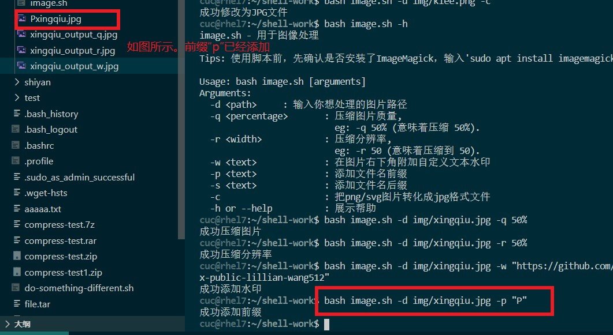
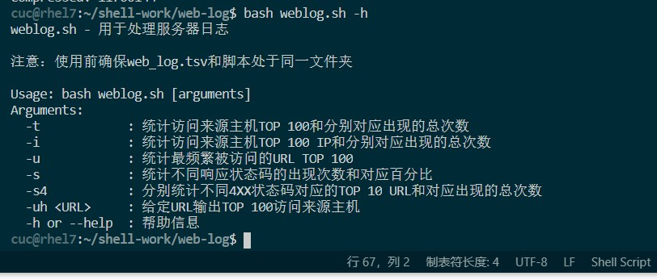

# linux第四次实验

## 【实验环境】：

- Virtualbox
- vscode
- Ubuntu 20.04 Server 64bit

## 【实验目标】：

任务一：用bash编写一个图片批处理脚本，实现以下功能：

- [x] 支持命令行参数方式使用不同功能

- [x] 支持对指定目录下所有支持格式的图片文件进行批处理

- [x] 支持以下常见图片批处理功能的单独使用或组合使用
  - [x] 支持对jpeg格式图片进行图片质量压缩
  - [x] 支持对jpeg/png/svg格式图片在保持原始宽高比的前提下压缩分辨率
  - [x] 支持对图片批量添加自定义文本水印
  - [x] 支持批量重命名（统一添加文件名前缀或后缀，不影响原始文件扩展名）
  - [x] 支持将png/svg图片统一转换为jpg格式图片

------

任务二：用bash编写一个文本批处理脚本，对以下附件分别进行批量处理完成相应的数据统计任务：

- [x] 2014世界杯运动员数据
  - [x] 统计不同年龄区间范围（20岁以下、[20-30]、30岁以上）的球员**数量**、**百分比**
  - [x] 统计不同场上位置的球员**数量**、**百分比**
  - [x] 名字最长的球员是谁？名字最短的球员是谁？
  - [x] 年龄最大的球员是谁？年龄最小的球员是谁？

------

任务三：用bash编写一个文本批处理脚本，对以下附件分别进行批量处理完成相应的数据统计任务：
- [x] Web服务器访问日志
  - [x] 统计访问来源主机TOP 100和分别对应出现的总次数
  - [x] 统计访问来源主机TOP 100 IP和分别对应出现的总次数
  - [x] 统计最频繁被访问的URL TOP 100
  - [x] 统计不同响应状态码的出现次数和对应百分比
  - [x] 分别统计不同4XX状态码对应的TOP 10 URL和对应出现的总次数
  - [x] 给定URL输出TOP 100访问来源主机

## 【实验内容】：

```
1.下载安装shellcheck以及imagemagick
sudo apt update
sudo apt install shellcheck
sudo apt install imagemagick

2.下载文件到本地：
wget "https://c4pr1c3.gitee.io/linuxsysadmin/exp/chap0x04/worldcupplayerinfo.tsv"
将Web服务器访问日志下载到本地:
wget "https://c4pr1c3.github.io/LinuxSysAdmin/exp/chap0x04/web_log.tsv.7z"
```


### 一、用bash编写一个图片批处理脚本

**具体代码在[image.sh](bash-code/image.sh)里**

ps.当时截图时没考虑批量，只是对单个进行了实验。后来考虑了批量后，代码如文档里的所示，是可以运行的。

#### 1. 帮助指南：

```bash
#查看帮助
bash image.sh -h
```


#### 2. 检验功能代码：

##### (1).对jpeg格式图片进行图片质量压缩

```bash
#对jpeg格式图片进行图片质量压缩
bash image.sh -d images/ -q 50%
```


##### (2).对jpeg/png/svg格式图片在保持原始宽高比的前提下压缩分辨率

```bash
#对jpeg/png/svg格式图片在保持原始宽高比的前提下压缩分辨率
bash image.sh -d images/ -r 50%
```


##### (3).对图片批量添加自定义文本水印

```bash
#对图片批量添加自定义文本水印
bash image.sh -d images/ -w "https://github.com/CUCCS/2022-linux-public-lillian-wang512"
```


##### (4).批量重命名（统一添加文件名前缀或后缀，不影响原始文件扩展名）

```bash
#批量重命名（统一添加文件名前缀或后缀，不影响原始文件扩展名）
bash image.sh -d images/ -p "P"
bash image.sh -d images/ -s "s"
```




##### (5).将png/svg图片统一转换为jpg格式图片

```bash
#将png/svg图片统一转换为jpg格式图片
bash image.sh -d images/ -c
```


【最后附上全部图片的具体数据变化】：

```bash
#查看图片具体数值
identify xxx.jpg xxx.png
```


### 二、用bash编写一个文本批处理脚本（2014世界杯）

#### 1. 帮助指南：

```bash
#查看帮助
bash worldcup.sh -h
```


#### 2. 检验功能代码：

**具体代码如[worldcup.sh](bash-code/worldcup.sh)所示**

##### (1).统计不同年龄区间范围（20岁以下、[20-30]、30岁以上）的球员数量、百分比

```bash
bash worldcup.sh -ad
```


##### (2).统计不同场上位置的球员数量、百分比

```bash
bash worldcup.sh -p
```


##### (3).名字最长的球员是谁？名字最短的球员是谁？

```bash
bash worldcup.sh -n
```


##### (4).年龄最大的球员是谁？年龄最小的球员是谁？

```bash
bash worldcup.sh -am
```


具体实验结果请见：[实验二（世界杯球员）结果](实验二（世界杯球员）结果)


### 三、用bash编写一个文本批处理脚本（web服务器访问日志）

#### 1.帮助指南

```bash
bash weblog.sh -h
```



#### 2.检验功能代码：

##### (1).统计访问来源主机TOP 100和分别对应出现的总次数

```bash
bash weblog.sh -t
```

##### (2).统计访问来源主机TOP 100 IP和分别对应出现的总次数

```bash
bash weblog.sh -i
```

##### (3).统计最频繁被访问的URL TOP 100

```bash
bash weblog.sh -u
```

##### (4).统计不同响应状态码的出现次数和对应百分比

```bash
bash weblog.sh -s
```

##### (5).分别统计不同4XX状态码对应的TOP 10 URL和对应出现的总次数

```bash
bash weblog.sh -s4
```

##### (6).给定URL输出TOP 100访问来源主机

```bash
bash weblog.sh -uh
```

具体实验结果请见：[实验三（web_log）实验结果](实验三（web_log）实验结果)


### 四、遇到的问题：

1.输出结果时想输出成一个表格形式的，但是对不齐？试了很久但就是上面两个“年龄最大的球员”很奇怪的对不齐……虽说不影响结果

```bash
#用过这些代码，不过还是对不齐
echo -e "$name\t\t$max" 

printf "%s %s\n"$name $max
```


2.做worldcup世界杯球员第二题时，由于一开始没有把tsv文件和sh放在同一个目录下，导致一开始无法成功执行命令。


### 五、参考资料：

- [Shell：批量图片添加水印](https://zhuanlan.zhihu.com/p/397806401)
- [AWK命令介绍及相关bash命令知识](https://www.cnblogs.com/greatkyle/p/6605134.html)
- [Shell printf 命令](https://www.runoob.com/linux/linux-shell-printf.html)
- [linux-2020-LyuLumos](https://github.com/CUCCS/linux-2020-LyuLumos)

- [CUCCS/linux-2020-han15179](https://github.com/CUCCS/linux-2020-han15179)
- [Travis CI Tutorial](https://docs.travis-ci.com/user/tutorial/)
- [文本左右对齐排版--shell](https://blog.csdn.net/dengjili/article/details/77800546)
- [Linux｜shell编程入门](https://baijiahao.baidu.com/s?id=1701686693229076458&wfr=spider&for=pc)
- [Bash编程语法](https://blog.csdn.net/weixin_44766148/article/details/109755250)
- [持续集成服务 Travis CI 教程](https://www.ruanyifeng.com/blog/2017/12/travis_ci_tutorial.html)


