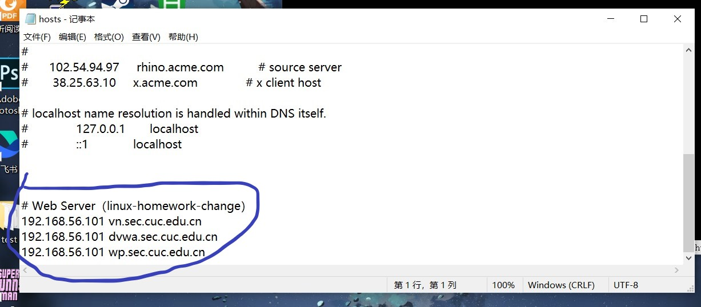
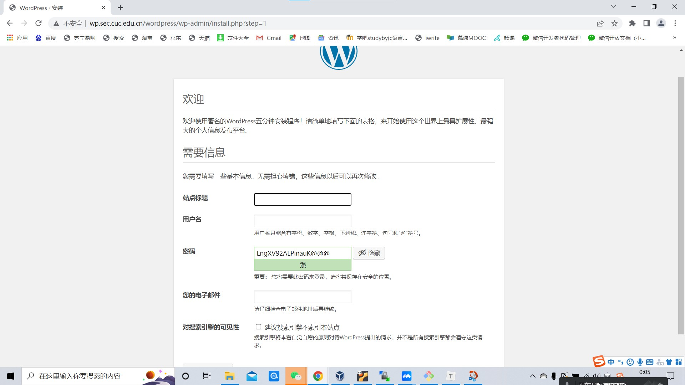
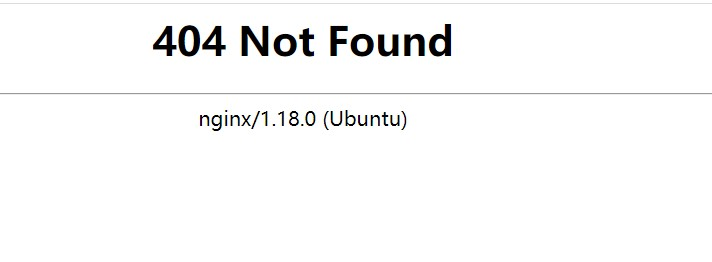

# linux第5次实验

## 【实验目的】

-  Web 服务器的搭建

## 【实验环境】

- 主机: Windows 10
- 虚拟机：Ubuntu 18.04.4 server 64bit
- Nginx/1.18.0
- Verynginx

## 【实验要求】

#### 软件环境建议

- [Nginx](http://nginx.org/)
- [VeryNginx](https://github.com/alexazhou/VeryNginx)
- Wordpress
  - [WordPress 4.7](https://wordpress.org/wordpress-4.7.zip) | [备用下载地址](https://github.com/WordPress/WordPress/archive/4.7.zip)
- [Damn Vulnerable Web Application (DVWA)](http://www.dvwa.co.uk/)

#### 基本要求

- [x] 在一台主机（虚拟机）上同时配置Nginx和VeryNginx
  - [x] VeryNginx作为本次实验的Web App的反向代理服务器和WAF
  - [x] PHP-FPM进程的反向代理配置在nginx服务器上，VeryNginx服务器不直接配置Web站点服务
  - [x] 使用[Wordpress](https://wordpress.org/)搭建的站点对外提供访问的地址为： http://wp.sec.cuc.edu.cn
  - [x] 使用[Damn Vulnerable Web Application (DVWA)](http://www.dvwa.co.uk/)搭建的站点对外提供访问的地址为： http://dvwa.sec.cuc.edu.cn

#### 安全加固要求

- [x] 使用IP地址方式均无法访问上述任意站点，并向访客展示自定义的**友好错误提示信息页面-1**
- [x] [Damn Vulnerable Web Application (DVWA)](http://www.dvwa.co.uk/)只允许白名单上的访客来源IP，其他来源的IP访问均向访客展示自定义的**友好错误提示信息页面-2**
- [x] 在不升级Wordpress版本的情况下，通过定制[VeryNginx](https://github.com/alexazhou/VeryNginx)的访问控制策略规则，**热**修复[WordPress < 4.7.1 - Username Enumeration](https://www.exploit-db.com/exploits/41497/)
- [x] 通过配置[VeryNginx](https://github.com/alexazhou/VeryNginx)的Filter规则实现对[Damn Vulnerable Web Application (DVWA)](http://www.dvwa.co.uk/)的SQL注入实验在低安全等级条件下进行防护

#### VeryNginx配置要求

- [x] [VeryNginx](https://github.com/alexazhou/VeryNginx)的Web管理页面仅允许白名单上的访客来源IP，其他来源的IP访问均向访客展示自定义的**友好错误提示信息页面-3**

- [x] 通过定制VeryNginx的访问控制策略规则实现：

  - [x] 限制DVWA站点的单IP访问速率为每秒请求数 < 50
  - [x] 限制Wordpress站点的单IP访问速率为每秒请求数 < 20
  - [x] 超过访问频率限制的请求直接返回自定义**错误提示信息页面-4**
  - [x] 禁止curl访问


## 【实验过程】

### 一、nginx

#### 1.下载Nginx安装包并解压

```
#使用wget命令下载Nginx安装包
wget http://nginx.org/download/nginx-1.20.1.tar.gz

#解压及目录
tar -zxvf nginx-1.20.1.tar.gz
```

#### 2.安装依赖包

```
sudo apt-get install libpcre3-dev
（注：ubuntu里没有pcre-devel这个包，不能用apt-get install pcre-devel）

sudo apt-get install openssl
（同上，RedHat、centos才是openssl-devel）
```


#### 3.安装nginx

```
#查看路径
ls

#切换路径
cd nginx-1.20.1

#检查，/configure用于对即将安装的软件进行配置，检查当前的环境是否满足安装软件的依赖关系
./configure

#执行命令
make && make install

#安装成功，切换到目录/usr/local/nginx（默认安装路径）
cd /usr/local/nginx
```


```
#进入sbin目录，用./nginx命令执行nginx脚本，成功启动nginx
cd sbin

#运行nginx脚本
./nginx
```


#### 4.解决报错！

若是出现报错：


查找，发现是因为80端口被占用（具体在问题与解决里有写）

```
#检查谁占用了80端口
netstat -apn|grep 80

#杀死占用的进程
kill -9 -711

#再次运行./nginx，成功了
./nginx
```


#### 5.检测是否成功（本机是否能访问80端口）

浏览器打开`虚拟机ip:80`

打开本机浏览器，输入192.168.56.101:80（就是打开80端口，发现能运行成功,出现如下截图）


### 二、更改主机host

```
# Web Server(linux-homework-change)
192.168.56.101 vn.sec.cuc.edu.cn
192.168.56.101 dvwa.sec.cuc.edu.cn
192.168.56.101 wp.sec.cuc.edu.cn
```



### 三、php及相关组件

```
sudo apt install php-fpm php-mysql php-curl php-gd php-intl php-mbstring php-soap php-xml php-xmlrpc php-zip
```


### 四、VeryNginx

**注意！必须cd到根目录下才能安装成功！不能在cuc里面，不然就会找不到去哪里了或者报错**

#### 1.clone仓库并安装

```
#切回根目录
cd

# 克隆VeryNginx仓库
git clone https://github.com/alexazhou/VeryNginx.git
cd VeryNginx
# python3
sudo python3 install.py install
```


#### 2.安装python3前对缺失的库补充安装

```
# zlib
sudo apt-get install zlib1g-dev
# pcre
sudo apt-get update 
sudo apt-get install libpcre3 libpcre3-dev
# gcc 
sudo apt install gcc
# make
sudo apt install make
# penssl library
sudo apt install libssl-dev
```

```
# 修改 /opt/verynginx/openresty/nginx/conf/nginx.conf配置文件
sudo vim /opt/verynginx/openresty/nginx/conf/nginx.conf

#修改以下部分：

# 用户名
user  www-data;

# 监听端口
# 为了不和其他端口冲突，此处设置为8080
server {
        listen 192.168.56.102:8080;
        
        #this line shoud be include in every server block
        include /opt/verynginx/verynginx/nginx_conf/in_server_block.conf;

        location = / {
            root   html;
            index  index.html index.htm;
        }
    }
```


#### 3.添加进程权限

```
chmod -R 777 /opt/verynginx/verynginx/configs
```

#### 4.检查权限是否添加成功

```
cd /opt/verynginx/verynginx/configs

ls -l  #检查目录下对应的权限
```


#### 5.启动verynginx

```
/opt/verynginx/openresty/nginx/sbin/nginx
```

#### 6.打开浏览器访问服务器的8080端口，安装成功


#### 7.进入verynginx

默认的用户名和密码`verynginx`/`verynginx` 进入`http://vn.sec.cuc.edu.cn:8080/verynginx/index.html`


- 登陆成功


### 五、Wordpress

#### 1.首先下载wordpress4.7安装包到 ubuntu18.04

```
# 下载安装包
sudo wget https://wordpress.org/wordpress-4.7.zip

# 解压，unzip需要提前安装 
unzip wordpress-4.7.zip

# 将解压后的wordpress移到指定路径
sudo mkdir /var/www/html/wp.sec.cuc.edu.cn
sudo cp -r wordpress /var/www/html/wp.sec.cuc.edu.cn

# 修改wp-config-sample中的内容，并更名为wp-config
cd /var/www/html/wp.sec.cuc.edu.cn/wordpress
sudo vim wp-config-sample.php
mv wp-config-sample.php wp-config.php   #mv a b  就是把a改名为b
```


#### 2.在MySQL中新建一个数据库用于wordpress

```
# 下载安装mysql数据库
sudo apt install mysql-server
# 登录
sudo mysql
```

```
# 新建一个数据库wordpress
CREATE DATABASE wordpress DEFAULT CHARACTER SET utf8 COLLATE utf8_unicode_ci;

# 新建用户
create user 'lillian'@'localhost' identified by 'wly$123456';

# 授权
grant all on wordpress.* to 'lillian'@'localhost';

#退出mysql
exit

#进入配置文件
sudo vim /var/www/html/wp.sec.cuc.edu.cn/wordpress/wp-config.php
#修改相关配置
// ** MySQL settings - You can get this info from your web host ** //
/** The name of the database for WordPress */
define('DB_NAME', 'wordpress');
/** MySQL database username */
define('DB_USER', 'lillian');
/** MySQL database password */
define('DB_PASSWORD', 'wly$123456');
/** MySQL hostname */
define('DB_HOST', 'localhost');
/** Database Charset to use in creating database tables. */
define('DB_CHARSET', 'utf8');
/** The Database Collate type. Don't change this if in doubt. */
define('DB_COLLATE', '');
```


#### 3.配置nginx

```
# 修改nginx配置 
sudo vim /etc/nginx/sites-enabled/default
sudo vim /etc/nginx/sites-available/wp
#具体配置见下图


#提权限，可读可写
chmod -R 777 /var/www/html/wp.sec.cuc.edu.cn

#读写权限检查
ls -l
```

#### 4.建立软连接并生效

```
 #使得链接生效
 sudo ln -s /etc/nginx/sites-available/wp/etc/nginx/sites-enabled/
 
 #（！注意！可能会有报错，改成sudo ln -sf /etc/nginx/sites-available/wp/etc/nginx/sites-enabled/ 就可以了，是强行覆盖的）
```

##### wp的具体配置：


##### default的具体配置：


##### 更改虚拟机host

（不知道为啥需要先切盘才能vim……）

```
cd 
cd /etc
sudo vim hosts

#具体配置见下图
192.168.56.101 vn.sec.cuc.edu.cn
192.168.56.101 dvwa.sec.cuc.edu.cn
192.168.56.101 wp.sec.cuc.edu.cn
```


#### 5.语法检查

```
sudo nginx -t
```

#### 6.重启nginx

```
sudo systemctl restart nginx
```

#### 7.访问wordpress

使用`wp.sec.cuc.edu.cn/wordpress/wp-admin/`访问wordpress进行配置

**(注意！不用加上https://，不然会连接不上)**

选择语言，然后连接数据库，设置完wordpress用户名密码即可访问wordpress网站。





```
# 用户名  lillian_wang
# 密码    LngXV92ALPinauK@@@
```


### 六、DVWA

#### 1.安装

```
# 下载
git clone https://github.com/digininja/DVWA.git
# 建立目录
sudo mkdir /var/www/html/dvwa.sec.cuc.edu.cn
# 移动文件夹内容至该目录下
sudo mv DVWA/* /var/www/html/dvwa.sec.cuc.edu.cn
```


#### 2.配置MySQL

```
sudo mysql
CREATE DATABASE dvwa DEFAULT CHARACTER SET utf8 COLLATE utf8_unicode_ci;
CREATE USER 'dvwa'@'localhost' IDENTIFIED BY 'password123456';
GRANT ALL ON dvwa.* TO 'dvwa'@'localhost';
exit
```


#### 3.配置PHP

```
cd /var/www/html/dvwa.sec.cuc.edu.cn/config

sudo mv config.inc.php.dist config.inc.php


# 默认配置：
$_DVWA[ 'db_database' ] = 'dvwa';
$_DVWA[ 'db_user' ] = 'dvwa';
$_DVWA[ 'db_password' ] = 'password123456';

# 修改php-fpm⽂件(大致在24%,42%)
sudo vim /etc/php/7.4/fpm/php.ini
display_errors: Off
safe_mode: Off
allow_url_include: On
allow_url_fopen: On


#重启php
systemctl restart php7.4-fpm.service
#授权给www-data⽤户和组
sudo chown -R www-data.www-data /var/www/html/dvwa.sec.cuc.edu.cn
```

#### 4.配置服务器块文件

```
# 创建新文件
sudo vim /etc/nginx/sites-available/dvwa.sec.cuc.edu.cn
# 写⼊配置⽂件
server {
 listen 8080 default_server;
 listen [::]:8080 default_server;
 root /var/www/html/dvwa.sec.cuc.edu.cn;
 index index.php index.html index.htm index.nginx-debian.html;
 server_name dvwa.sec.cuc.edu.cn;
 location / {
 #try_files $uri $uri/ =404;
 try_files $uri $uri/ /index.php$is_args$args; 
 }
 location ~ \.php$ {
 include snippets/fastcgi-php.conf;
 fastcgi_pass unix:/var/run/php/php7.4-fpm.sock;
 }
 location ~ /\.ht {
 deny all;
 }
}
# 创建软链接
sudo ln -s /etc/nginx/sites-available/dvwa.sec.cuc.edu.cn /etc/nginx/sites-enabled/
# 检查并重启服务
sudo nginx -t
systemctl restart nginx.service
```

#### 5.访问dvwa

[DVWA网址](http://dvwa.sec.cuc.edu.cn)


### 七、实验要求

#### 1.使用VeryNginx反向代理Wordpress,DVWA

这里可能会遇到登不上去的问题（端口被占用），导致全部都变成dvwa，这时需要输入`http://wp.sec.cuc.edu.cn/wordpress/wp-admin/`这个网址就成功进入了


#### 2.安全加固要求

##### (1).使用IP地址方式均无法访问上述任意站点，并向访客展示自定义的友好错误提示信息页面-1

###### 1.matcher


###### 2.response


###### 3.filter


###### 4.结果


##### (2).Damn Vulnerable Web Application (DVWA)只允许⽩名单上的访客来源IP，其他来源的IP访问均向访客展示自定义的友好错误提示信息页面-2

###### 1.matcher


###### 2.response


###### 3.filter


###### 4.结果


##### (3)在不升级Wordpress版本的情况下，通过定制[VeryNginx](https://github.com/alexazhou/VeryNginx)的访问控制策略规则，**热**修复[WordPress < 4.7.1 - Username Enumeration](https://www.exploit-db.com/exploits/41497/)

###### 1.找到漏洞脚本，拷贝到本机并命名为err.php

```
sudo vim err.php
```


###### 2.修改相应参数

```
$url = "http://wp.sec.cuc.edu.cn/";
```

###### 3.安装依赖包

```
sudo apt install php7.4-cli (不用按，php-fpm时安装了)
```

###### 4.执行脚本

```
php err.php
```

###### 5.制定安全策略

- ##### 在**Basic**中添加匹配规则


- ##### 在**Custom Action**中添加过滤条件


- 结果：




##### (4).通过配置[VeryNginx](https://github.com/alexazhou/VeryNginx)的Filter规则实现对[Damn Vulnerable Web Application (DVWA)](http://www.dvwa.co.uk/)的SQL注入实验在低安全等级条件下进行防护

###### 1.将security level修改为low


###### 2.dvwa sql injection


###### 3.添加matcher


###### 4.添加filter


###### 5.结果


#### 3.VeryNginx配置要求

##### (1).[VeryNginx](https://github.com/alexazhou/VeryNginx)的Web管理页面仅允许白名单上的访客来源IP，其他来源的IP访问均向访客展示自定义的**友好错误提示信息页面-3**

###### 1.添加匹配规则


###### 2.添加响应：友好错误提示信息页面-3的响应信息


###### 3.在Custom Action中添加过滤条件


###### 4.结果


##### (2).通过定制VeryNginx的访问控制策略规则实现：

###### 1.限制DVWA站点的单IP访问速率为每秒请求数 < 50

###### 2.限制Wordpress站点的单IP访问速率为每秒请求数 < 20

- 设置自定义响应fast_fast：


- 设置频率限制Frequency Limit


###### 3.超过访问频率限制的请求直接返回自定义错误提示信息页面-4

###### 4.禁止curl访问

- 设置matcher


- 设置filter


- crul访问


## 【问题与反思】

#### 1.swp文件：


出现奇怪的swp文件

（当我们编辑一个文件的时候，另外一个人也在编辑的时候，会出现；当我们编辑文件时候，突然断电，或者突然断网，为了防止数据丢失，也会出现这种文件）

2.配置nginx的时候报错需要安装PCRE，然后执行指令yum -y install pcre-devel之后报错没有proc。。之后因为yum在ubuntu里不能使用，所以换成apt-get install pcre-devel，，，然后又报如下错误


最后才发现在ubuntu里没有pcre-devel这个包。。
应该是使用如下指令：

```bash
sudo apt-get install libpcre3-dev
```

#### 2.`./nginx`启动不成功


查找，发现是因为[80端口被占用](https://jingyan.baidu.com/article/3a2f7c2ecb0de726afd611a8.html)

解决：

```
#检查谁占用了80端口
netstat -apn|grep 80

#杀死占用的进程
kill -9 -711

#再次运行./nginx
./nginx
```

#### 3.`cp -r`

使用cp命令拷贝文件时，会出现如下[报错](https://jingyan.baidu.com/article/b7001fe191f0f80e7382dd5a.html)：`cp:omitting directory`


查找原因发现，是因为目录下还有目录，不能直接进行拷贝，此时使用`cp -r`就可以啦！

#### 4.重启nginx不成功：


```
service nginx stop 
service nginx start 
service nginx start restart
```

#### 5.建立软连接不成功：


[【软连接已存在，如何覆盖】ln: failed to create symbolic link ‘file.txt’: File exists](https://www.jianshu.com/p/c60e90fb1a46)

把 **-s** 命令修改成 **-sf** 命令；**-f** 命令的意思是强制执行，也就意味着如果不存在就执行创建，存在就执行覆盖掉

至此，软连接创建完成...

```
sudo ln -sf /etc/nginx/sites-available/wp/etc/nginx/sites-enabled/
```

#### 6.连入wordpress不成功

一直很疑惑为什么……折磨了我一个下午加晚上，改了一大堆后发现，原来只是因为不能加https，小丑竟是我自己。


#### 7.配置完dvwn后可能出现的问题：

配完dvwn后之前配置好的verynginx，wordpress都登录不上去了，全部变成了dvwn……后来发现应该是端口被占用的问题，此时需要：

- 换个网址
- 把verynginx的端口号改了（我之前设的是8080，现在改成8081就可以登录上去了）
- 网址：
- [verynginx](http://192.168.56.101:8081/verynginx/index.html)
- [wordpress](http://wp.sec.cuc.edu.cn/wordpress/wp-admin/)


#### 8.使用IP地址方式均无法访问上述任意站点，并向访客展示自定义的友好错误提示信息页面-1后，无法访问verynginx的问题

因为自己把自己屏蔽了（我只能用ip进行访问verynginx），导致之后一直进不去verynginx,后来阅读官方文档发现，

提示
通过 VeryNginx 控制面板保存新配置之后，会立刻生效，并不需要 restart/reload Nginx。
VeryNginx 把配置保存在 /opt/verynginx/verynginx/configs/config.json 里面。
状态页面图表默认带有动画效果，如果有卡顿，可以点右上角齿轮图标关掉动画效果

如果因为配错了什么选项，导致无法登录，可以手动删除 config.json 来清空配置，或者手动编辑这个文件来修复。

所以就删除它

```
sudo rm /opt/verynginx/verynginx/configs/config.json
```

然后重启（我的需要重启verynginx才能重新访问，不会自动刷新，不然还是在屏蔽中）

```
#启动服务
/opt/verynginx/openresty/nginx/sbin/nginx

#停止服务
/opt/verynginx/openresty/nginx/sbin/nginx -s stop

#重启服务
/opt/verynginx/openresty/nginx/sbin/nginx -s reload
```


## 【参考资料】：

- [nginx安装配置](https://blog.csdn.net/qq_34383510/article/details/121181126)

- [端口被占用的报错](https://jingyan.baidu.com/article/3a2f7c2ecb0de726afd611a8.html)

- [安装openssl-dev 报错E: Unable to locate package openssl-dev](https://blog.csdn.net/liujian8654562/article/details/101113461)

- [报错：Unable to locate package pcre-devel](https://blog.csdn.net/changyana/article/details/123453329)

- [wordpress本地环境配置--mysql](https://www.php.cn/cms/wordpress/481328.html)

- [linux swp文件是什么](https://www.php.cn/linux-484531.html)

- [hosts文件修改教程](https://product.pconline.com.cn/itbk/software/dnwt/1510/7087678.html)

- [linux vim操作提示：“Can't open file for writing”或“operation not permitted”的解决办法](https://blog.csdn.net/helloxiaozhe/article/details/80758364)

- [VeryNginx详细配置说明](https://blog.51cto.com/u_15329153/3370974)

- [tcping--windows访问ip和端口](https://blog.csdn.net/qq_41028058/article/details/117991099)

- [Linux中如何开启8080端口供外界访问 和开启允许对外访问的端口8000](https://blog.51cto.com/u_11103019/3771817)

- [nginx配置说明以及VeryNginx使用](https://blog.csdn.net/weixin_40803329/article/details/101446194)

- [verynginx部署---重启停止开始](https://www.cnblogs.com/cxd4321/p/13800059.html)

- [linux怎么重命名文件](https://m.php.cn/article/482376.html)

- [VeryNginx中文文档](https://blog.51cto.com/u_6207455/3344924)